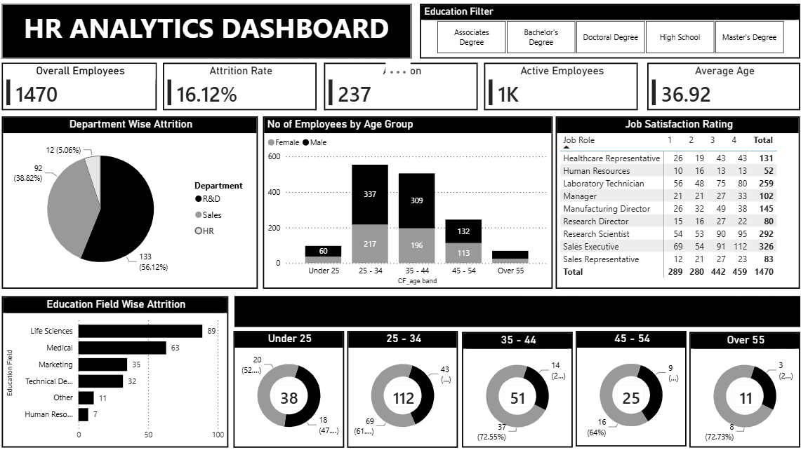

# 📊 HR Analytics Dashboard

> End-to-End HR Analytics Project using **Power BI, SQL, Excel, and Data Analysis** to identify employee attrition trends, workforce distribution, and key HR insights.

---

## 📌 Live Dashboard

👉 https://app.powerbi.com/view?r=eyJrIjoiMDc0NGUzODQtMTYxMS00ODI3LWI0NjMtMzU3NGRiNWNlZmU0IiwidCI6Ijk5OWRmM2FjLTA2NjAtNDg4ZS1iMDcwLWE1MGMyZmY2M2VlYiJ9

---

# Dashboard Preview



---

# Project Overview

Employee attrition is one of the biggest challenges for organizations. This project analyzes HR data to identify workforce trends, employee demographics, department performance, and factors contributing to employee attrition.

The project demonstrates complete Business Intelligence workflow including:

- Data Cleaning
- SQL Analysis
- KPI Calculation
- Dashboard Development
- Business Insights
- Interactive Reporting

---

# Business Problem

Organizations need to answer questions like:

- Why are employees leaving?
- Which department has the highest attrition?
- Which education field has maximum resignations?
- Which age group is most affected?
- What is the average employee age?
- Which job roles experience the highest attrition?

This dashboard provides answers through interactive visualizations.

---

# Objectives

- Monitor employee attrition
- Analyze workforce demographics
- Compare department performance
- Identify high-risk employee groups
- Build an interactive HR dashboard
- Support HR decision-making using data

---

# Dataset Information

**Records:** 1,470 Employees

**Columns:** 15

Dataset includes:

- Employee ID
- Gender
- Age
- Age Band
- Marital Status
- Department
- Education
- Education Field
- Job Role
- Business Travel
- Job Satisfaction
- Attrition
- Active Employee
- Employee Count

---

# Tech Stack

| Tool | Purpose |
|------|----------|
| Power BI | Dashboard Development |
| SQL | Data Analysis |
| Excel | Data Cleaning |
| Power Query | ETL |
| DAX | KPI Calculations |

---

# Dashboard KPIs

The dashboard includes:

- Total Employees
- Attrition Count
- Attrition Rate
- Active Employees
- Average Age

---

# Dashboard Features

## Department-wise Attrition

Compare attrition across:

- HR
- R&D
- Sales

---

## Education Field Attrition

Analyze attrition by:

- Medical
- Life Sciences
- Marketing
- Technical Degree
- Human Resources
- Other

---

## Attrition by Age Group

Employees grouped into:

- Under 25
- 25–34
- 35–44
- 45–54
- Over 55

---

## Job Satisfaction Analysis

Compare Job Satisfaction scores across different Job Roles.

---

# SQL Analysis

The SQL file includes multiple analytical queries such as:

- Total Employees
- Attrition Count
- Attrition Rate
- Department-wise Attrition
- Gender Analysis
- Education Analysis
- Average Age
- Education Field Analysis
- Age Group Analysis
- Job Satisfaction Analysis

---

# Project Workflow

```text
Dataset
      │
      ▼
Excel Cleaning
      │
      ▼
SQL Analysis
      │
      ▼
Power Query
      │
      ▼
Data Modeling
      │
      ▼
DAX Measures
      │
      ▼
Power BI Dashboard
      │
      ▼
Business Insights
```

---

# Business Insights

### Overall Attrition

- Attrition Rate is approximately **16%**.
- 237 employees have left the organization.

### Department Analysis

- R&D has the highest employee count.
- Sales contributes significantly to attrition.

### Education Analysis

- Employees from Life Sciences and Medical backgrounds show higher attrition.

### Age Analysis

- Employees aged 25–34 contribute the highest attrition.

### Job Satisfaction

- Lower satisfaction levels are associated with higher employee turnover.

---

# Repository Structure

```
DA-HR-Analytics
│
├── Dashboard.png
├── HR Analytics Power BI.pbix
├── HR Analytics SQL.sql
├── HR Analytics Excel.xlsx
├── HR Dataset.xlsx
├── hrdataset.csv
└── README.md
```

---

# Skills Demonstrated

- Data Cleaning
- Data Analysis
- SQL Queries
- KPI Development
- DAX
- Power Query
- Data Visualization
- Business Intelligence
- Dashboard Design
- HR Analytics
- Interactive Reporting

---

# Key Learnings

- Data Transformation
- Employee Attrition Analysis
- HR KPI Reporting
- Dashboard Development
- SQL Reporting
- Power BI Data Modeling
- Business Storytelling

---

# Future Improvements

- Add Predictive Attrition Model using Machine Learning
- Department-level Drillthrough Pages
- Employee Retention Forecast
- HR Trend Analysis
- Monthly Attrition Tracking
- Performance Score Analysis
- Salary Analysis Dashboard

---

# Author

**Chaitanya Gadwala**

Data Analyst

GitHub:
https://github.com/chaitanyagadwalait-droid

---

⭐ If you found this project useful, consider giving it a Star!
